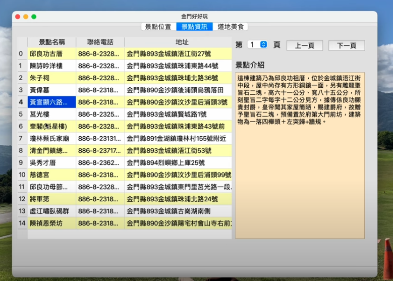

# PYQT
Function library for designing user interface (GUI)

## QoE-Cloud Gaming of Quality of Experience App
[Introduction video Link](https://youtu.be/mocs9sxl9x4)

- **Through surveys, we gather user feedback on their gaming experience under different network environments and periodically collect relevant network parameters during gameplay.**

- **Screenshot**: Displays screenshots of players during gameplay. Users can select each screenshot file using a dropdown menu. The buttons below allow navigation to the first page, previous page, next page, or last page. Finally, users can click "Exit" to leave the app.

- **Objective QoE**: Shows the average network parameters for players in the game, such as ping time, packet loss, and frame age. Users can select each player's data through a dropdown menu.
  

- **Subjective QoE**: Displays players' feedback scores for each round regarding their experience with game graphics quality (Graphics), game response time (Interactive), self-performance in the game (Self Assessment), and overall game experience (Opinion).
  

## Kinmen_Python_App
[Introduction video Link](https://youtu.be/aToHfPyB6lU)
- **Scenic Spot Location:** Using the API (Application Programming Interface) provided by the Central Weather Bureau's open data platform, the latitude and longitude coordinates of the required scenic spots in Kinmen are retrieved. When the user clicks on any scenic spot from the dropdown menu, the location of the spot is displayed on the map.
  

- **Scenic Spot Information:** Detailed information about the locations is organized and displayed in a table format. When the user clicks on a table entry, the detailed information of the selected scenic spot is shown on the right side. Additionally, users can navigate through the pages using a dropdown menu and buttons.
  

- **Local Kinmen Cuisine:** Introduces the local cuisine of Kinmen. When the user selects a dish from the dropdown menu, an image of the dish is displayed. The buttons allow the user to choose to go to the previous or next page.

## Research Paper Database App
- SQLite Studio installation URL: [https://github.com/pawelsalawa/sqlitestudio/releases](https://github.com/pawelsalawa/sqlitestudio/releases)
- Use SQLite Studio, and the database file is named **test.sqlite**.
- The database contains three tables: **Authors, PaperAuthors, and Papers**.
 
- Query paper titles.
 
- Display related information of the paper (clicking the title in the table displays related images of the paper).
 
- Users can choose whether to save the data.
 
- Search based on different types of paper presentations.
 
- Count the number of papers published by authors for all poster presentations.
 
